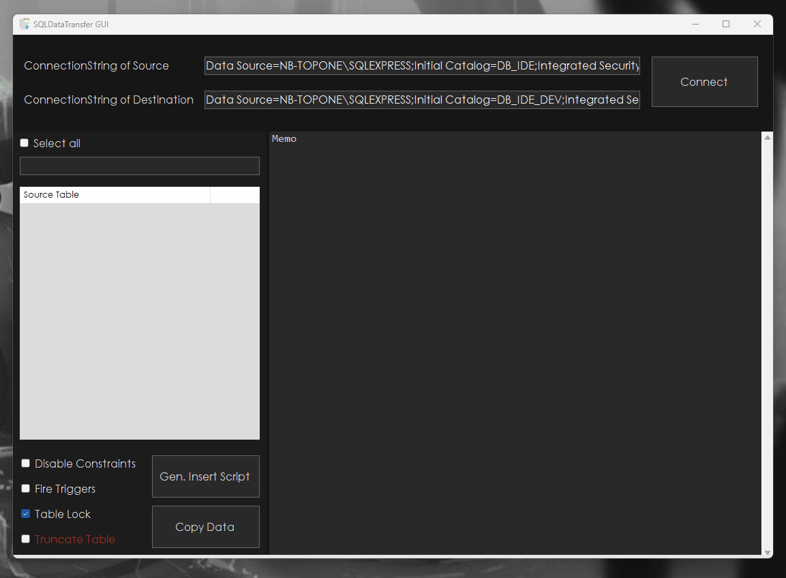
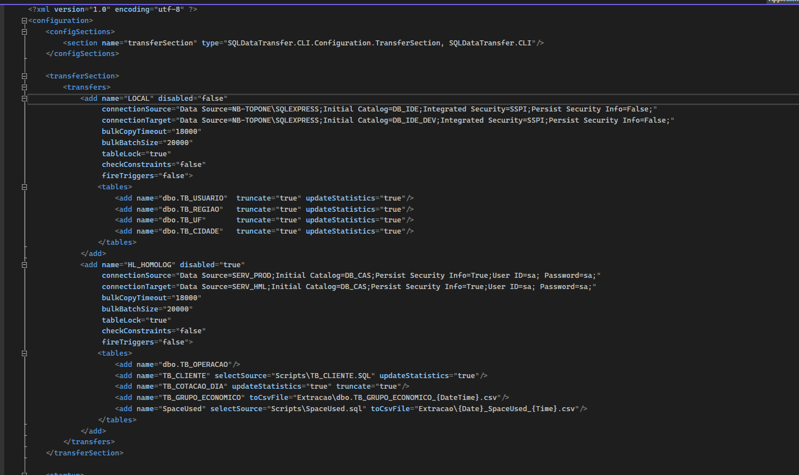

<div id="top" align="center" style="text-align:center;">
<h1>
  
  <br>🎲 SQL Data Transfer

  [](https://www.codefactor.io/repository/github/heliomarpm/sqldatatransfer)
  [](https://github.com/heliomarpm/SQLDataTransfer)
  <a href="https://navto.me/heliomarpm" target="_blank"></a>
</h1>

<p>
  <!-- PixMe -->
  <a href="https://www.pixme.bio/heliomarpm" target="_blank" rel="noopener noreferrer">
    
  </a>
  <!-- PayPal -->
  <a href="https://bit.ly/paypal-udeler" target="_blank" rel="noopener noreferrer">
    
  </a>
  <!-- Ko-fi -->
  <a href="https://ko-fi.com/heliomarpm" target="_blank" rel="noopener noreferrer">
    
  </a>
  <!-- LiberaPay -->  
  <a href="https://liberapay.com/heliomarpm" target="_blank" rel="noopener noreferrer">
     
  </a>
  <!-- Version -->
  <a href="https://github.com/heliomarpm/SQLDataTransfer/releases" target="_blank" rel="noopener noreferrer">
     
  </a>
  <!-- Downloads -->
  <a href="https://github.com/heliomarpm/SQLDataTransfer/releases" target="_blank" rel="noopener noreferrer">
    
  </a>
  <!-- Issues -->
  <!-- <a href="https://github.com/heliomarpm/SQLDataTransfer/issues?q=is%3Aissue+is%3Aopen+sort%3Aupdated-desc" target="_blank">
    
  </a> -->
  <!-- License -->
  <a href="https://github.com/heliomarpm/SQLDataTransfer/blob/master/LICENSE" target="_blank" rel="noopener noreferrer">
    
  </a>
</p>
</div>

  
  &nbsp;
  
O SQLDataTransfer é uma ferramenta para Cópia de Dados SQL Server, que foi desenvolvida para auxiliar na geração de arquivos e cópia eficiente de dados entre bases de dados SQL Server.
Todo o processameno é otimizado utilizando BulkCopy, o que significa que as tabelas de origem e destino precisam ter a mesma estrutura de dados.

Com a interface gráfica (GUI) permite que os usuários selecionem as tabelas que desejam copiar apenas clicando nelas, o que torna a ferramenta mais intuitiva e fácil de usar. \
Além disso, a opção de linha de comando oferece flexibilidade adicional, permitindo aos usuários especificar o que deve ser copiado através do arquivo de configuração do aplicativo (app.config). Isso inclui a possibilidade de determinar quais registros devem ser copiados usando scripts SQL e cópiar da origem para arquivos csv como destino.

Essa abordagem híbrida, combinando a interface gráfica e a linha de comando, é ótima, pois atende a diferentes necessidades e preferências dos usuários. Alguns usuários podem preferir a simplicidade da GUI, enquanto outros podem preferir a flexibilidade e o controle da linha de comando.

Com essa ferramenta, os usuários poderão copiar dados entre bases de dados SQL Server de maneira mais eficiente, aproveitando a funcionalidade de bulk e facilitando o processo de migração, sincronização ou backup de dados.

## Características Principais

* Cópia otimizada de dados entre bases de dados SQL Server.
* Interface gráfica intuitiva para seleção de tabelas a serem copiadas.
* Suporte para cópia personalizada usando linha de comando e scripts SQL.
* Utilização do arquivo de configuração (app.config) para determinar o que deve ser copiado.
* Propriedades de configuração durante a copia como:
  * Ativar/Desativar constrainsts durante a copia
  * Ativar/Desativar bloqueio da tabela de origem durante a cópia
  * Ativar/Desativar disparo de triggers nas tabelas de destino
  * Opção de truncate na tabela de destino, antes de inicar a cópia


## Como Usar

### Interface Gráfica (GUI)
1. Execute o arquivo executável da ferramenta.
2. Na interface gráfica, informe as conexões de base e selecione as tabelas que deseja copiar.
3. Clique no botão "Copy" para iniciar o processo de cópia de dados.
4. Acompanhe o progresso da cópia na interface gráfica e aguarde a conclusão.
5. Um log de resultado é apresentado durante todo o processo de cópia

### Linha de Comando
1. Abra o arquivo de configuração (app.config) no local onde o executável está localizado.
1. Edite o arquivo de configuração para definir quais registros devem ser copiados usando scripts SQL.
1. Execute o arquivo executável da ferramenta a partir da linha de comando.
1. Aguarde o processo de cópia de dados ser concluído e verifique o resultado.

## Exemplos de Uso

### Interface GUI



-- ou --

### Interface CLI



* Arquivo de Config
```xml
<?xml version="1.0" encoding="utf-8" ?>
<configuration>
	<configSections>
		<section name="transferSection" type="SQLDataTransfer.CLI.Configuration.TransferSection, SQLDataTransfer.CLI"/>
	</configSections>

	<transferSection>
		<transfers>
			<add name="LOCAL" disabled="false"
				 connectionSource="Data Source=NB-TOPONE\SQLEXPRESS;Initial Catalog=DB_IDE;Integrated Security=SSPI;Persist Security Info=False;"
				 connectionTarget="Data Source=NB-TOPONE\SQLEXPRESS;Initial Catalog=DB_IDE_DEV;Integrated Security=SSPI;Persist Security Info=False;"
				 bulkCopyTimeout="18000"
				 bulkBatchSize="20000"
				 tableLock="true"
				 checkConstraints="false"
				 fireTriggers="false">
				<tables>
					<add name="dbo.TB_USUARIO"	truncate="true" updateStatistics="true"/>
					<add name="dbo.TB_REGIAO"	truncate="true" updateStatistics="true"/>
					<add name="dbo.TB_UF"		truncate="true" updateStatistics="true"/>
					<add name="dbo.TB_CIDADE"	truncate="true" updateStatistics="true"/>
				</tables>
			</add>
			<add name="HL_HOMOLOG" disabled="true"
				 connectionSource="Data Source=SERV_PROD;Initial Catalog=DB_CAS;Persist Security Info=True;User ID=sa; Password=sa;"
				 connectionTarget="Data Source=SERV_HML;Initial Catalog=DB_CAS;Persist Security Info=True;User ID=sa; Password=sa;"
				 bulkCopyTimeout="18000"
				 bulkBatchSize="20000"
				 tableLock="true"
				 checkConstraints="false"
				 fireTriggers="false">
				<tables>
					<add name="dbo.TB_OPERACAO"/>
					<add name="TB_CLIENTE" selectSource="Scripts\TB_CLIENTE.SQL" updateStatistics="true"/>
					<add name="TB_COTACAO_DIA" updateStatistics="true" truncate="true"/>
					<add name="TB_GRUPO_ECONOMICO" toCsvFile="Extracao\dbo.TB_GRUPO_ECONOMICO_{DateTime}.csv"/>
					<add name="SpaceUsed" selectSource="Scripts\SpaceUsed.sql" toCsvFile="Extracao\{Date}_SpaceUsed_{Time}.csv"/>
				</tables>
			</add>
		</transfers>
	</transferSection>

</configuration>
```

## Contribuição 

Você pode contribuir para o desenvolvimento do ResizeIt.

- :star: Dando uma estrela neste repositório _(isso é muito importante e não custa nada)_
- :beetle: Relatando problemas ou solitando recursos _([Issues](https://github.com/heliomarpm/SQLDataTransfer/issues))_
- :computer: Enviando solicitações de recursos _([Pull Requests](https://github.com/heliomarpm/SQLDataTransfer/pulls))_
- :page_facing_up: Melhorando esta documentação
- :rotating_light: Compartilhando este projeto e recomendando-o aos seus amigos
- :dollar: Apoiando este projeto no GitHub Sponsors, PayPal, Ko-fi ou Liberapay _(você decide)_ 😉

<!--
Obrigado, a todas as pessoas que já contribuiram com esse projeto

<a href="https://github.com/heliomarpm/SQLDataTransfer/graphs/contributors" target="_blank">
  
</a>

###### Made with [contrib.rocks](https://contrib.rocks).
-->


## Donate

Se você aprecia isso, considere doar para o desenvolvedor.

<p align="center">
  <!-- PixMe -->
  <a href="https://www.pixme.bio/heliomarpm" target="_blank" rel="noopener noreferrer">
    
  </a>
  <!-- PayPal -->
  <a href="https://bit.ly/paypal-udeler" target="_blank" rel="noopener noreferrer">
    
  </a>
  <!-- Ko-fi -->
  <a href="https://ko-fi.com/heliomarpm" target="_blank" rel="noopener noreferrer">
    
  </a>
  <!-- LiberaPay -->  
  <a href="https://liberapay.com/heliomarpm" target="_blank" rel="noopener noreferrer">
     
  </a>  
  <!-- GitHub Sponsors -->
  <a href="https://github.com/sponsors/heliomarpm" target="_blank" rel="noopener noreferrer">
    
  </a>
</p>


## Licença

O SQLDataTransfer é distribuído sob a licença MIT. Consulte o arquivo `LICENSE` para obter mais informações.
[MIT © Heliomar P. Marques](https://github.com/heliomarpm/SQLDataTransfer/blob/main/LICENSE) <a href="#top">🔝</a>


## Agradecimentos
Agradeço por utilizar este software. Espero que ele seja útil e facilite suas tarefas de cópia de dados. \
Se tiver alguma dúvida ou sugestão, não hesite em perguntar.

[Última Versão](https://github.com/heliomarpm/SQLDataTransfer/releases/latest)
